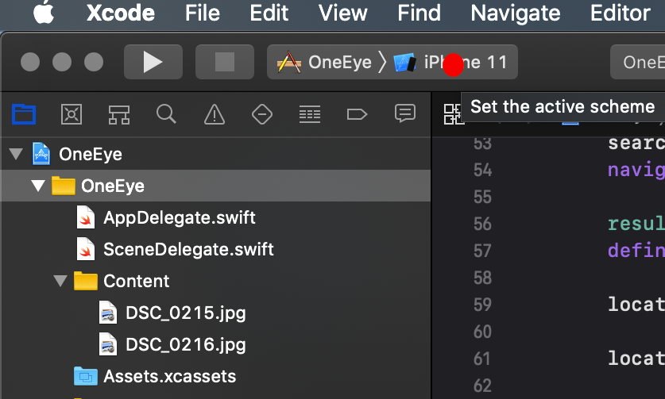
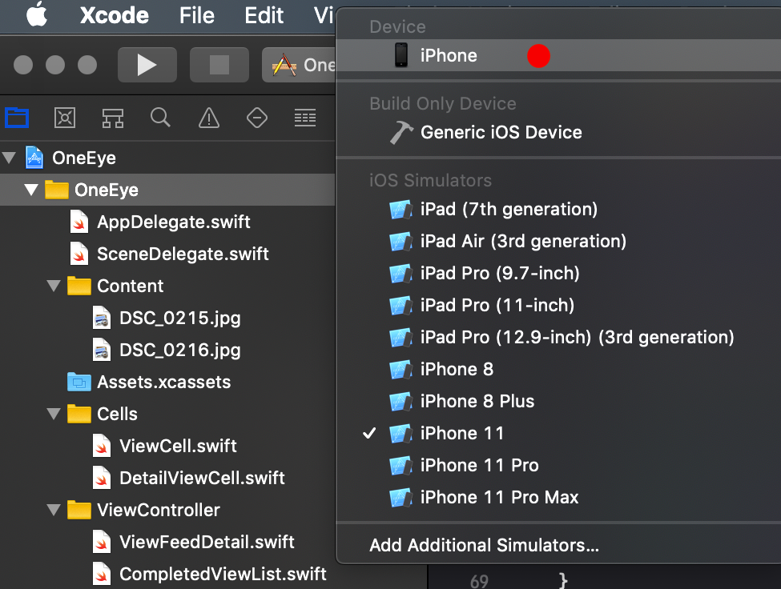
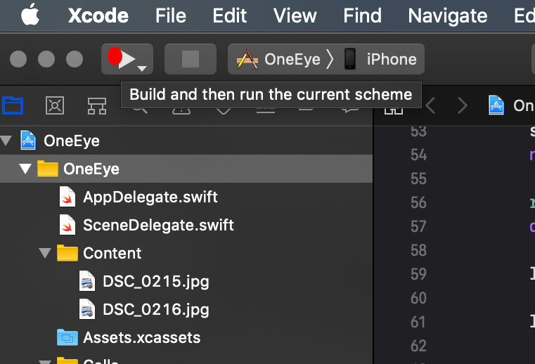

# OnEye

## TODO by order of priority
Capture video or from file
Monitor user post location and accept post based on that
Requests table view 
Firebase database for requests, posts
Firebase storage for videos/images
Link firebase to table views, uibuttons... 
Firebase for user authentication
Filter for posts
Add time as a parameter and remove content after time T

## Running the code
- Open XCode 11
- In the command line: $git clone https://github.com/gn3112/OnEye.git 
- Open OneEye.xcodeproj in the project directory
### Running an emulator or use your device for viewing the app
- Once XCode project is open, select a device for the app simulation:

- Select simulator or your device (prior to that connect your iphone):

- Run and build the project:

